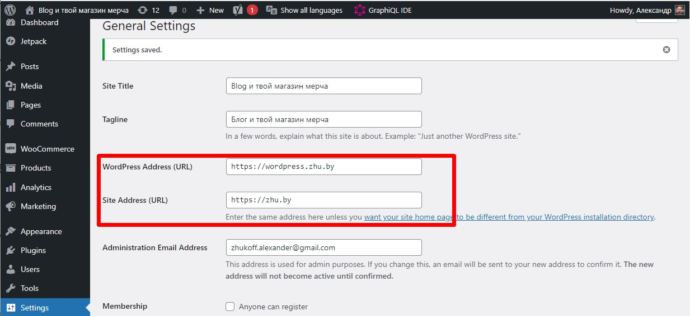
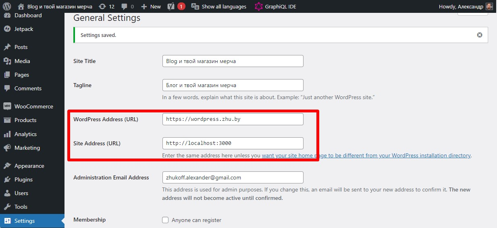
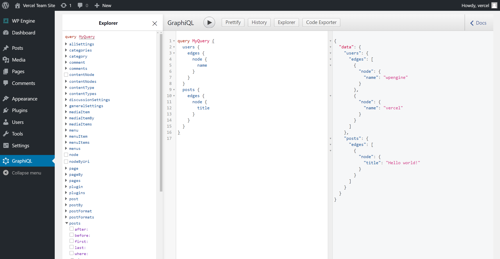
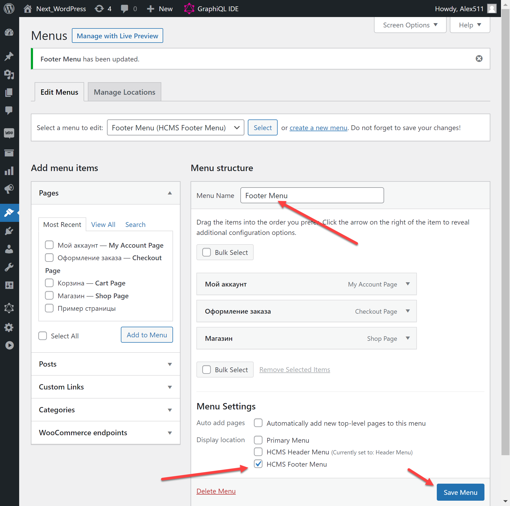
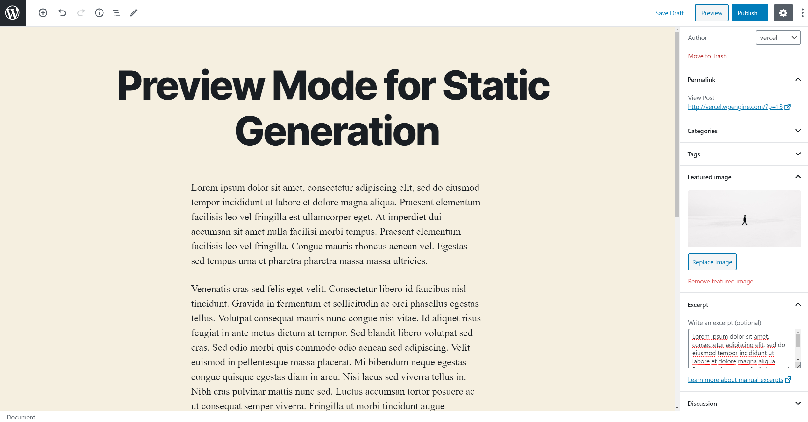
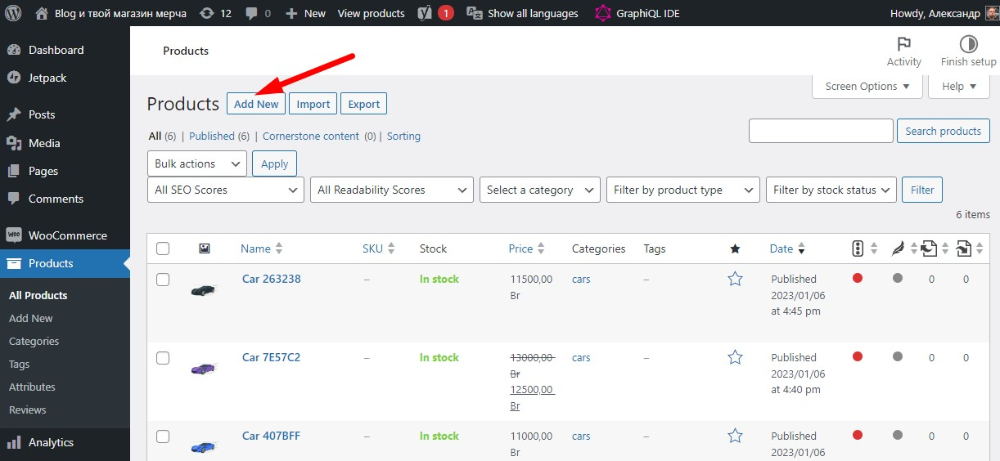

# Online store 20,000+ products on NextJs (React) + WordPress

Online store 20000+ products. There is a menu with categories (1200+ categories of goods). Pagination, product filter, product sorting, product search, shopping cart, product search page,
Implemented user authentication and authorization, new user registration, and password reset via Email.

A personal account with editing personal information has been implemented—data on products, categories, and users stored in WordPress. WordPress is converted into a Headless CMS through plug-ins and serves to manage the content without the frontend component.

Frontend part is done in NextJs(React) + TailwindCSS.
Data transfer: GraphQL, Apollo.
The current implementation allows me to separate the frontend and backend on different servers and have multiple frontend applications based on one WordPress.
Currently continuing work on this project.

## Demo

### [https://shop.zhu.by/](https://shop.zhu.by/)

## Installation

1. Clone the repository:

```bash
git clone https://github.com/Zhuk-off/shopNext12.git`.
```

2. Navigate to the project directory:

```bash
cd shop7
```

3. Install dependencies:

```bash
npm install
```

## Configuration

### Step 1. Prepare your WordPress site

First, you need a WordPress site. There are many solutions for WordPress hosting, such as [WP Engine](https://wpengine.com/) and [WordPress.com](https://wordpress.com/).

You will need the following plugins to work properly.
Install them in your WordPress.

1. [WPGraphQL](https://ru.wordpress.org/plugins/wp-graphql/) - A plugin to access basic WordPress functionality via GraphQL

2. [Headless CMS](https://codeytek.com/headless-cms-wordpress-plugin/) - Plugin for easy header and footer management via REST API

3. [Cyr-To-Lat](https://ru.wordpress.org/plugins/cyr2lat/) - Plugin to display page paths correctly if you work with Cyrillic alphabet

4. [Yoast SEO](https://ru.wordpress.org/plugins/wordpress-seo/) - Plugin for SEO optimization of your site

5. [Add WPGraphQL SEO](https://ru.wordpress.org/plugins/add-wpgraphql-seo/) - Plugin to access Yoast SEO via GraphQL

6. [WooCommerce](https://ru.wordpress.org/plugins/woocommerce/) - Plugin for e-commerce

7. [WPGraphQL WooCommerce (WooGraphQL)](https://github.com/wp-graphql/wp-graphql-woocommerce) - This plugin to work with WooCommerce via WPGraphQL

8. [WPGraphQL CORS](https://github.com/funkhaus/wp-graphql-cors) - The primary purpose of this plugin is to make the WP GraphQL plugin authentication "just work". It does this by allowing you set the CORS headers that GraphQL will accept, which means that WordPress's default authentication cookies will be accepted.

9. [WPGraphQL JWT Authentication](https://github.com/wp-graphql/wp-graphql-jwt-authentication) - This plugin extends the WPGraphQL plugin to provide authentication using JWT (JSON Web Tokens)

10. [WPGraphQL Offset Pagination](https://github.com/valu-digital/wp-graphql-offset-pagination) - Adds traditional offset pagination support to WPGraphQL

11. [WP Mail Logging](https://ru.wordpress.org/plugins/wp-mail-logging/) - WP Mail Logging is the most popular plugin for logging emails sent from your WordPress site

12. [WordPress Mail SMTP](https://ru.wordpress.org/plugins/wp-mail-smtp/) - WP Mail SMTP fixes your email deliverability by reconfiguring WordPress to use a proper SMTP provider when sending emails.

#### Customize client and server side

Let's separate the client and server parts in WordPress so that there are no conflicts.
The best option I can suggest is :
Save the client part as our website address (https://zhu.by).
The server part will be saved as a subdomain (https://wordpress.zhu.by).

Option for deployment on the server:



Option for local server:



#### WPGraphQL

Once the site is ready, you'll need to install the [WPGraphQL](https://www.wpgraphql.com/) plugin. It will add GraphQL API to your WordPress site, which we'll use to query the posts. Follow these steps to install it:

- Download the [WPGraphQL repo](https://github.com/wp-graphql/wp-graphql) as a ZIP archive.
- Inside your WordPress admin, go to **Plugins** and then click **Add New**.


- Click the **Upload Plugin** button at the top of the page and upload the WPGraphQL plugin.


- Once the plugin has been added, activate it from either the **Activate Plugin** button displayed after uploading or from the **Plugins** page.


The [WPGraphQL](https://www.wpgraphql.com/) plugin also gives you access to a GraphQL IDE directly from your WordPress Admin, allowing you to inspect and play around with the GraphQL API.



#### Headless CMS Plugin

Allows us to create menus for header and footer.

Create a menu for the header and footer of your site. To do this, go to the menu of your WordPress site Appearance -> Menus

Example of working with the plugin:



### Step 2. Populate Content

Inside your WordPress admin, go to **Posts** and start adding new posts:

- We recommend creating at least **2 posts**
- Use dummy data for the content
- Pick an author from your WordPress users
- Add a **Featured Image**. You can download one from [Unsplash](https://unsplash.com/)
- Fill in the **Excerpt** field



When you're done, make sure to **Publish** the posts.

> **Note:** Only **published** posts and public fields will be rendered by the app unless [Preview Mode](https://nextjs.org/docs/advanced-features/preview-mode) is enabled.

Inside your WordPress admin, go to Product and start adding new products by analogy:

Also add some products to the Product menu in the same way:



### Step 3. Set up environment variables

Copy the `.env.local.example` file in this directory to `.env.local` (which will be ignored by Git):

```bash
cp .env.local.example .env.local
```

Then open `.env.local` and set `WORDPRESS_API_URL` to be the URL to your GraphQL endpoint in WordPress. For example: `https://zhu.by/graphql`.

Your `.env.local` file should look like this:

```bash
WORDPRESS_API_URL="https://wordpress.zhu.by/graphql"

NEXT_PUBLIC_WORDPRESS_SITE_URL=https://wordpress.zhu.by
NEXT_PUBLIC_SITE_URL=https://zhu.by
# or for local development, use
# NEXT_PUBLIC_SITE_URL=http://localhost:3000

#To track visitors through Google Analytics and Yandex Metrika, use the IDs you have received in your Google and Yandex user account
NEXT_PUBLIC_GA_ID=G-...
NEXT_PUBLIC_YM_ID=...

# Only required if you want to enable preview mode
WORDPRESS_AUTH_REFRESH_TOKEN="..."
WORDPRESS_PREVIEW_SECRET="..."

# Authorization via NextAuth.
# NEXTAUTH_SECRET - random code needed to generate tokens. Taken from the head.
# NEXTAUTH_URL - address where authentication will take place
NEXTAUTH_URL=http://localhost:3000/login
NEXTAUTH_SECRET="..."

```

### Step 4. Add authentication for Preview Mode

By default, the blog will work with public posts from your WordPress site. Private content such as unpublished posts and private fields cannot be retrieved. To have access to unpublished posts you'll need to set up authentication.

To add authentication to WPGraphQL, first you need to add the WPGraphQL JWT plugin to your WordPress Admin following the same process you used to add the WPGraphQL plugin.

Adding the WPGraphQL JWT plugin will disable your GraphQL API until you add a JWT secret ([GitHub issue](https://github.com/wp-graphql/wp-graphql-jwt-authentication/issues/91)).

Once that's done, you'll need to access the WordPress filesystem to add the secret required to validate JWT tokens. We recommend using SFTP — the instructions vary depending on your hosting provider. For example:

- [SFTP guide for WP Engine](https://wpengine.com/support/sftp/)
- [SFTP guide for WordPress.com](https://wordpress.com/support/sftp/)

Once you have SFTP access, open `wp-config.php` and add a secret for your JWT:

```bash
define( 'GRAPHQL_JWT_AUTH_SECRET_KEY', 'YOUR_STRONG_SECRET' );
```

You can read more about this in the documentation for WPGraphQL JWT Authentication.

Now, you need to get a `refresh token` to make authenticated requests with GraphQL. Make the following GraphQL mutation to your WordPress site from the GraphQL IDE (See notes about WPGraphiQL from earlier). Replace **your_username** with the `username` of a user with the **Administrator** role, and `your_password` with the user's password.

```bash
mutation Login {
  login(
    input: {
      clientMutationId: "uniqueId"
      password: "your_password"
      username: "your_username"
    }
  ) {
    refreshToken
  }
}
```

Copy the `refreshToken` returned by the mutation, then open `.env.local`, and make the following changes:

Uncomment `WORDPRESS_AUTH_REFRESH_TOKEN` and set it to be the `refreshToken` you just received.
Uncomment `WORDPRESS_PREVIEW_SECRET` and set it to be any random string (ideally URL friendly).
Your `.env.local` file should look like this:

```bash
WORDPRESS_API_URL=...

# Only required if you want to enable preview mode
WORDPRESS_AUTH_REFRESH_TOKEN=...
WORDPRESS_PREVIEW_SECRET=...
```

Important: Restart your Next.js server to update the environment variables.

### Step 5. Run Next.js in development mode

```bash

npm run dev

# or

yarn dev
```

Your blog should be up and running on [http://localhost:3000](http://localhost:3000)!

## Contacts

You can contact me by email: zhukoffweb@gmail.com
